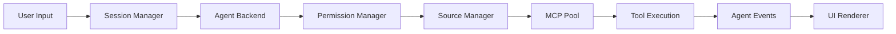

## Introduction

Craft Agents is a flexible AI agent framework built around **workspaces**, **sessions**, and **agent backends**. The architecture emphasizes isolation boundaries, multi-provider support, and extensibility through sources (MCP servers and API connections).

## Core Architecture

<CardGroup cols={2}>
  <Card title="Workspaces" icon="folder-tree" color="#8B5CF6" href="/concepts/workspaces">
    Project-scoped configuration with isolated sources and sessions
  </Card>
  <Card title="Sessions" icon="messages" color="#8B5CF6" href="/concepts/sessions">
    Conversation boundaries with 1:1 SDK session mapping
  </Card>
  <Card title="Agent Backends" icon="robot" color="#8B5CF6" href="/concepts/agents">
    Provider-agnostic agent implementations (Claude, Pi, OpenAI)
  </Card>
  <Card title="Sources" icon="plug" color="#8B5CF6" href="/features/sources/overview">
    MCP servers and API connections for external data
  </Card>
</CardGroup>

## Key Design Principles

### Sessions as Primary Boundary

Sessions are the **primary isolation boundary** in Craft Agents, not workspaces:

- Each session maps **1:1 with an SDK session** (Claude Agent SDK, Pi SDK, etc.)
- Sessions have their own permission mode, working directory, and conversation history
- Multiple sessions can coexist in the same workspace with different configurations
- Sessions persist their complete state (messages, token usage, metadata) in JSONL format

<Note>
**Why sessions?** This design allows multiple conversations with different contexts to run in the same project without contaminating each other's state.
</Note>

### Multi-Provider Support

The `BaseAgent` abstract class provides a unified interface across AI providers:

```typescript
import type { AgentBackend } from '@craft-agent/shared/agent';

// All backends implement the same interface
interface AgentBackend {
  chat(message: string): AsyncGenerator<AgentEvent>;
  abort(reason?: string): Promise<void>;
  getModel(): string;
  setModel(model: string): void;
  getPermissionMode(): PermissionMode;
  // ... and more
}
```

Supported backends:

- **ClaudeAgent** - Anthropic Claude models via Claude Agent SDK
- **PiAgent** - Pi coding agents via Pi SDK (subprocess)
- **CodexAgent** - OpenAI models via Codex app-server (planned)
- **CopilotAgent** - GitHub Copilot integration (planned)

### Source Architecture

Sources are **workspace-scoped external data connections** that provide tools to agents:

<Accordion title="MCP Sources">
Model Context Protocol servers running as subprocesses:

```json
{
  "type": "mcp",
  "slug": "linear",
  "name": "Linear",
  "command": "npx",
  "args": ["-y", "@linear/mcp"],
  "env": { "LINEAR_API_KEY": "{{credential}}" }
}
```
</Accordion>

<Accordion title="API Sources">
Direct HTTP API integrations with authentication:

```json
{
  "type": "api",
  "slug": "github",
  "name": "GitHub",
  "baseUrl": "https://api.github.com",
  "authType": "bearer",
  "endpoints": [
    {
      "method": "GET",
      "path": "/repos/{owner}/{repo}/issues",
      "description": "List repository issues"
    }
  ]
}
```
</Accordion>

<Accordion title="Local Sources">
Local filesystem directories with custom tools:

```json
{
  "type": "local",
  "slug": "knowledge-base",
  "name": "Knowledge Base",
  "paths": ["/path/to/docs"]
}
```
</Accordion>

### Permission System

Three-level permission modes provide granular control over agent actions:

| Mode | Display | Behavior |
|------|---------|----------|
| `safe` | Explore | Read-only, blocks all write operations |
| `ask` | Ask to Edit | Prompts for bash commands (default) |
| `allow-all` | Auto | Auto-approves all commands |

<Info>
Permission mode is **per-session**, allowing different trust levels for different conversations in the same workspace.
</Info>

## Data Flow



### Event Stream

All agent backends emit standardized `AgentEvent` types:

```typescript
type AgentEvent =
  | { type: 'text'; text: string }
  | { type: 'tool_start'; toolName: string; input: unknown }
  | { type: 'tool_result'; result: string }
  | { type: 'permission_request'; requestId: string; toolName: string }
  | { type: 'complete' }
  | { type: 'error'; message: string };
```

The event stream provides a **provider-agnostic interface** for rendering agent activity in the UI.

## Storage Layout

All data is stored under `~/.craft-agent/`:

```
~/.craft-agent/
├── config.json                 # Global config, LLM connections
├── credentials.enc             # Encrypted credentials (AES-256-GCM)
├── docs/                       # Bundled documentation
├── workspaces/
│   └── {workspace-id}/
│       ├── config.json         # Workspace metadata
│       ├── theme.json          # Workspace theme overrides
│       ├── permissions.json    # Workspace permission rules
│       ├── statuses/           # Custom workflow statuses
│       ├── sources/
│       │   └── {slug}/
│       │       ├── config.json # Source configuration
│       │       └── guide.md    # Usage guidelines
│       └── sessions/
│           └── {session-id}/
│               ├── session.jsonl      # Messages + header
│               ├── attachments/       # File attachments
│               ├── plans/            # Plan files
│               ├── data/             # Transform output
│               └── long_responses/   # Summarized results
```

<Note>
**JSONL Format**: Sessions use JSONL (JSON Lines) for efficient streaming writes and incremental reads. Line 1 is the header (metadata), subsequent lines are messages.
</Note>

## Package Structure

The codebase is organized as a monorepo:

```
packages/
├── core/              # Shared TypeScript types
├── shared/            # Business logic (agent, auth, config)
├── ui/                # React components
├── session-mcp-server/    # Session-scoped MCP tools
├── pi-agent-server/       # Pi SDK subprocess wrapper
└── bridge-mcp-server/     # API source bridge (planned)

apps/
├── electron/          # Main Electron app
└── web-viewer/        # Standalone session viewer
```

## Next Steps

<CardGroup cols={2}>
  <Card title="Workspaces" icon="folder" href="/concepts/workspaces">
    Learn about workspace configuration and storage
  </Card>
  <Card title="Sessions" icon="message" href="/concepts/sessions">
    Understand session lifecycle and persistence
  </Card>
  <Card title="Agents" icon="robot" href="/concepts/agents">
    Explore agent backends and the BaseAgent class
  </Card>
  <Card title="Sources" icon="plug" href="/features/sources/overview">
    Configure MCP servers and API connections
  </Card>
</CardGroup>
