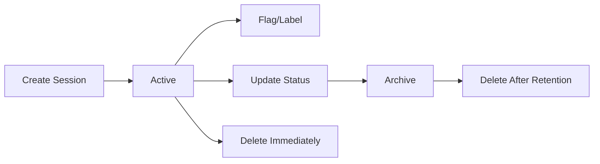

Craft Agents provides a powerful session management system that persists all your conversations to disk, making them searchable, recoverable, and organized. Each session is stored in a human-readable format with automatic naming, metadata tracking, and efficient persistence.

## Core Concepts

Sessions in Craft Agents are workspace-scoped conversations that store:

<CardGroup cols={2}>
  <Card title="Conversation Data" icon="comments">
    All messages, tool calls, and agent responses in JSONL format
  </Card>
  <Card title="Metadata" icon="tag">
    Names, labels, statuses, flags, and timestamps
  </Card>
  <Card title="Attachments" icon="paperclip">
    File uploads, plans, and downloaded resources
  </Card>
  <Card title="Token Usage" icon="chart-line">
    Input/output tokens, costs, and cache statistics
  </Card>
</CardGroup>

## Storage Structure

Sessions are stored at `{workspaceRootPath}/sessions/{id}/` with the following structure:

```
sessions/
  260304-swift-river/        # Human-readable session ID
    session.jsonl            # Main data file (header + messages)
    attachments/             # User-uploaded files
    plans/                   # Safe Mode plan files
    data/                    # Transform tool output
    long_responses/          # Summarized tool results
    downloads/               # API-downloaded resources
```

<Note>
The JSONL format stores the session header on line 1 (for fast list loading) and one message per line thereafter.
</Note>

## Session Identifiers

### Human-Readable IDs

Craft Agents generates memorable session IDs in the format:

```
YYMMDD-adjective-noun
```

**Examples:**
- `260304-swift-river`
- `260305-bright-forest`
- `260305-bright-forest-2` (collision handling)

<Steps>
  <Step title="Date Prefix">
    YYMMDD format makes sessions time-sortable
  </Step>
  <Step title="Random Words">
    ~20,000 unique combinations per day from curated word lists
  </Step>
  <Step title="Collision Handling">
    Numeric suffix added if the base ID already exists
  </Step>
</Steps>

### Code Example

```typescript packages/shared/src/sessions/slug-generator.ts
export function generateUniqueSessionId(
  existingIds: Set<string> | string[],
  date: Date = new Date()
): string {
  const existingSet = existingIds instanceof Set ? existingIds : new Set(existingIds);
  const datePrefix = generateDatePrefix(date);

  // Try up to 100 times to find a unique slug
  for (let attempt = 0; attempt < 100; attempt++) {
    const slug = generateHumanSlug();
    const baseId = `${datePrefix}-${slug}`;

    if (!existingSet.has(baseId)) {
      return baseId;
    }
  }
}
```

## Session Persistence

### Debounced Async Queue

Craft Agents uses a sophisticated persistence queue to avoid blocking the UI during saves:

<Tabs>
  <Tab title="Queue Behavior">
    **Automatic Debouncing:** Multiple rapid changes are coalesced into a single write (500ms window)

    **Async I/O:** All writes use Node.js async file operations to prevent main thread blocking

    **Per-Session Serialization:** Writes are serialized per session to prevent race conditions on `.tmp` files

    **Atomic Writes:** Write to `.tmp` file, then rename to prevent corruption on crash
  </Tab>
  <Tab title="Usage">
    ```typescript
    import { saveSession, sessionPersistenceQueue } from '@craft-agent/shared/sessions';

    // Immediate flush (waits for completion)
    await saveSession(storedSession);

    // Queue for async persistence (debounced)
    sessionPersistenceQueue.enqueue(storedSession);

    // Flush all pending on app quit
    await sessionPersistenceQueue.flushAll();
    ```
  </Tab>
</Tabs>

<Warning>
Always call `sessionPersistenceQueue.flushAll()` during app shutdown to ensure no data loss.
</Warning>

## JSONL Format

Sessions are stored in JSONL (JSON Lines) format for efficient streaming and fast list views:

**Line 1: Session Header**
```json
{
  "id": "260304-swift-river",
  "workspaceRootPath": "~/.craft-agent/workspaces/default",
  "createdAt": 1709568000000,
  "lastUsedAt": 1709571600000,
  "name": "Build API docs",
  "sessionStatus": "in-progress",
  "labels": ["bug", "priority::2"],
  "messageCount": 12,
  "preview": "Help me refactor the authentication module",
  "tokenUsage": { "totalTokens": 15420, "costUsd": 0.42 }
}
```

**Lines 2+: Messages**
```json
{"role":"user","content":"Help me refactor the authentication module"}
{"role":"assistant","content":"I'll analyze the current code..."}
```

<Note>
The header includes pre-computed fields (message count, preview, token usage) so the UI can render session lists without parsing all messages.
</Note>

## Session Metadata

### Tracked Fields

| Field | Type | Description |
|-------|------|-------------|
| `id` | string | Unique session identifier |
| `name` | string? | Optional user-defined name |
| `createdAt` | number | Unix timestamp (milliseconds) |
| `lastUsedAt` | number | Last access time (any activity) |
| `lastMessageAt` | number? | Last meaningful message (for date grouping) |
| `sessionStatus` | string | Current status (todo/in-progress/done/etc) |
| `labels` | string[] | Applied labels ("bug", "priority::3") |
| `isFlagged` | boolean? | Whether session is flagged |
| `isArchived` | boolean? | Whether session is archived |
| `hasUnread` | boolean? | Whether session has unread messages |
| `permissionMode` | string? | Permission mode (safe/ask/allow-all) |
| `model` | string? | LLM model override |
| `workingDirectory` | string? | Current working directory |

### Code Example

```typescript packages/shared/src/sessions/storage.ts
export async function updateSessionMetadata(
  workspaceRootPath: string,
  sessionId: string,
  updates: Partial<SessionConfig>
): Promise<void> {
  const session = loadSession(workspaceRootPath, sessionId);
  if (!session) return;

  if (updates.isFlagged !== undefined) session.isFlagged = updates.isFlagged;
  if (updates.name !== undefined) session.name = updates.name;
  if (updates.sessionStatus !== undefined) session.sessionStatus = updates.sessionStatus;
  if (updates.labels !== undefined) session.labels = updates.labels;

  await saveSession(session);
}
```

## Listing Sessions

The storage layer provides filtered views for different UI contexts:

<CardGroup cols={2}>
  <Card title="Active Sessions" icon="inbox">
    ```typescript
    listActiveSessions(workspaceRootPath)
    // Returns non-archived sessions
    ```
  </Card>
  <Card title="Inbox Sessions" icon="circle-dot">
    ```typescript
    listInboxSessions(workspaceRootPath)
    // Returns sessions with 'open' status
    ```
  </Card>
  <Card title="Completed Sessions" icon="circle-check">
    ```typescript
    listCompletedSessions(workspaceRootPath)
    // Returns sessions with 'closed' status
    ```
  </Card>
  <Card title="Archived Sessions" icon="archive">
    ```typescript
    listArchivedSessions(workspaceRootPath)
    // Returns archived sessions only
    ```
  </Card>
</CardGroup>

## Performance Optimization

The session system is designed for workspaces with thousands of sessions:

<Steps>
  <Step title="Fast List Loading">
    Only reads the first line (header) of each JSONL file
  </Step>
  <Step title="Pre-Computed Fields">
    Message count, preview, and token usage stored in header
  </Step>
  <Step title="Lazy Message Loading">
    Full conversation loaded only when viewing a session
  </Step>
  <Step title="Debounced Persistence">
    Rapid changes coalesced into single disk write
  </Step>
</Steps>

## Session Lifecycle



## Next Steps

<CardGroup cols={2}>
  <Card title="Inbox & Archive" icon="inbox" href="/features/sessions/inbox">
    Learn about flagging and workflow navigation
  </Card>
  <Card title="Status System" icon="circle-dot" href="/features/sessions/statuses">
    Understand the dynamic status system
  </Card>
  <Card title="Labels" icon="tags" href="/features/sessions/labels">
    Organize sessions with hierarchical labels
  </Card>
</CardGroup>