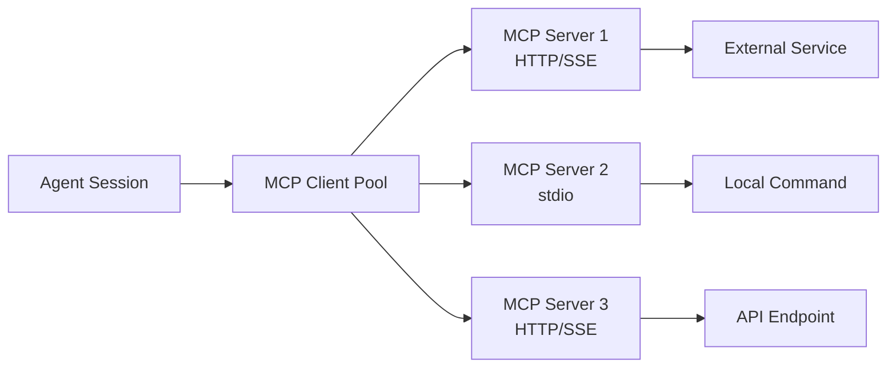

<Info>
The Model Context Protocol (MCP) is an open standard for connecting AI assistants to external data sources and tools.
</Info>

## What is MCP?

The **Model Context Protocol** (MCP) is an open protocol that standardizes how AI applications communicate with external data sources. Instead of building custom integrations for every service, MCP provides a universal interface that works across all compatible servers.

### Key Benefits

<CardGroup cols={2}>
  <Card title="Universal Protocol" icon="network-wired">
    One standard interface works with hundreds of MCP servers
  </Card>
  <Card title="Real-time Data" icon="bolt">
    Access live data from external services during agent sessions
  </Card>
  <Card title="Extend Capabilities" icon="puzzle-piece">
    Add new tools and functionality without modifying core code
  </Card>
  <Card title="Community Ecosystem" icon="users">
    Growing library of pre-built servers for popular services
  </Card>
</CardGroup>

## MCP Architecture

Craft Agents implements MCP through a centralized client pool that manages all source connections:



### How It Works

<Steps>
  <Step title="Configure Source">
    Create a source configuration with connection details (URL or command)
  </Step>
  <Step title="Connect to Server">
    The MCP client pool establishes connection using the specified transport
  </Step>
  <Step title="List Tools">
    Server exposes available tools through the MCP protocol
  </Step>
  <Step title="Execute Tools">
    Agent can call tools during sessions with automatic auth and result handling
  </Step>
</Steps>

## MCP Transports

Craft Agents supports two transport mechanisms for connecting to MCP servers:

### HTTP/SSE Transport

For **remote MCP servers** accessible via HTTP or Server-Sent Events:

<CodeGroup>
```json Remote MCP Server
{
  "type": "mcp",
  "mcp": {
    "transport": "http",
    "url": "https://api.example.com/mcp"
  }
}
```

```json With Authentication
{
  "type": "mcp",
  "mcp": {
    "transport": "http",
    "url": "https://api.example.com/mcp"
  },
  "authType": "bearer"
}
```
</CodeGroup>

<Note>
HTTP transport automatically appends `/mcp` to URLs if not present. The Craft MCP server uses this transport.
</Note>

### Stdio Transport

For **local MCP servers** that run as subprocesses:

<CodeGroup>
```json NPX Command
{
  "type": "mcp",
  "mcp": {
    "transport": "stdio",
    "command": "npx",
    "args": ["-y", "@modelcontextprotocol/server-brave-search"]
  }
}
```

```json Node Script
{
  "type": "mcp",
  "mcp": {
    "transport": "stdio",
    "command": "node",
    "args": ["/path/to/server.js"]
  }
}
```

```json Python Script
{
  "type": "mcp",
  "mcp": {
    "transport": "stdio",
    "command": "python",
    "args": ["/path/to/server.py"]
  }
}
```
</CodeGroup>

<Warning>
Local MCP servers run as subprocesses. Sensitive environment variables (API keys, tokens) are automatically filtered to prevent credential leakage.
</Warning>

## MCP Authentication

MCP servers support multiple authentication methods:

### No Authentication

For public or local servers that don't require credentials:

```json
{
  "authType": "none"
}
```

### Bearer Token

For servers that use bearer token authentication:

```json
{
  "authType": "bearer"
}
```

<Note>
The app will prompt you to enter the bearer token during source setup. Credentials are encrypted with AES-256-GCM and stored in `~/.craft-agent/credentials.enc`.
</Note>

### OAuth 2.0

For services that use OAuth 2.0 (like Craft, Slack):

```json
{
  "authType": "oauth",
  "oauth": {
    "authorizationUrl": "https://api.example.com/oauth/authorize",
    "tokenUrl": "https://api.example.com/oauth/token",
    "clientId": "your-client-id",
    "scope": "read write"
  }
}
```

### Custom Headers

For HTTP/SSE transport with custom authentication:

```json
{
  "mcp": {
    "transport": "http",
    "url": "https://api.example.com/mcp",
    "headers": {
      "X-API-Key": "your-api-key",
      "X-Custom-Header": "value"
    }
  }
}
```

## Security

### Credential Storage

All credentials are encrypted with **AES-256-GCM** before being stored on disk:

- **Storage location**: `~/.craft-agent/credentials.enc`
- **Encryption**: Industry-standard AES-256-GCM
- **Access**: Only the Craft Agents app can decrypt credentials

### Local MCP Isolation

When spawning local MCP servers (stdio transport), sensitive environment variables are filtered:

**Blocked variables:**
- `ANTHROPIC_API_KEY`, `CLAUDE_CODE_OAUTH_TOKEN` (app auth)
- `AWS_ACCESS_KEY_ID`, `AWS_SECRET_ACCESS_KEY`, `AWS_SESSION_TOKEN`
- `GITHUB_TOKEN`, `GH_TOKEN`, `OPENAI_API_KEY`, `GOOGLE_API_KEY`
- `STRIPE_SECRET_KEY`, `NPM_TOKEN`

<Note>
To explicitly pass environment variables to a specific MCP server, use the `env` field in the source config.
</Note>

## Tool Naming Convention

When MCP servers are connected, their tools are exposed with a namespaced prefix:

```
mcp__{sourceSlug}__{toolName}
```

**Example:**
- Source slug: `linear`
- Tool name: `createIssue`
- Full tool name: `mcp__linear__createIssue`

This prevents naming conflicts when multiple sources provide similar tools.

## Connection Management

The MCP client pool manages all source connections:

- **Persistent connections**: Sources remain connected for the session lifetime
- **Automatic reconnection**: Failed connections are retried automatically
- **Tool caching**: Tool definitions are cached after first connection
- **Graceful shutdown**: All connections are closed when the app exits

## Next Steps

<CardGroup cols={2}>
  <Card title="Craft MCP Server" icon="craft" href="/integrations/mcp/craft-mcp">
    Connect to your Craft workspace with 32+ document tools
  </Card>
  <Card title="Custom MCP Servers" icon="code" href="/integrations/mcp/custom-servers">
    Add your own MCP servers via HTTP/SSE or local commands
  </Card>
</CardGroup>
